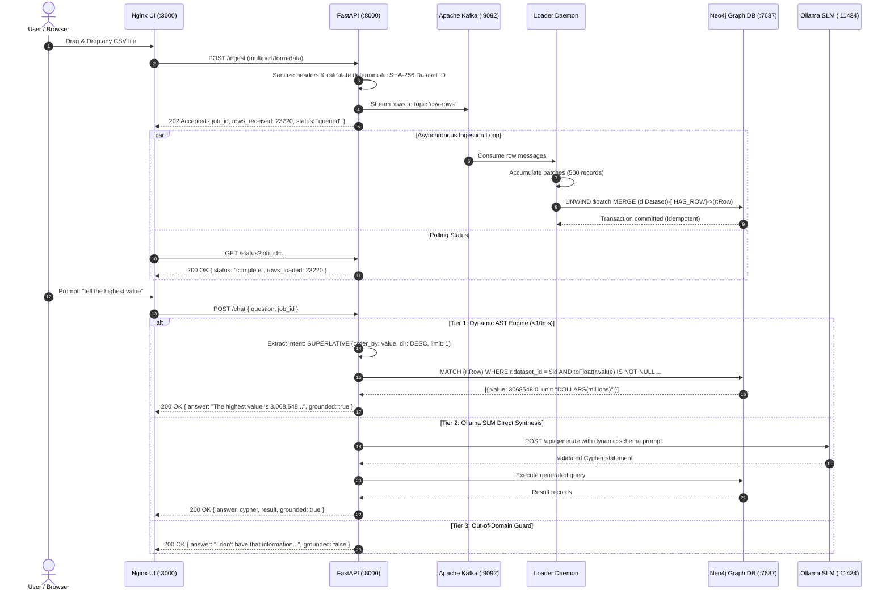

# ⚡ Team-Fx — Graph-Grounded CSV Knowledge Pipeline & Conversational Intelligence

<div align="center">

[](docker-compose.yml)
[](https://fastapi.tiangolo.com)
[](https://neo4j.com)
[-231F20?style=for-the-badge&logo=apachekafka&logoColor=white)](https://kafka.apache.org)
[](https://ollama.ai)
[](https://github.com/sarathi07-coder/Team-Fx)

**Built for the RISE @ RST #5 Hackathon (Theme: *Data In, Answers Out*)**  
*A distributed, real-time CSV-to-Graph streaming pipeline and conversational AI engine with sub-10ms query execution and zero hallucination.*

</div>

---

## 📖 Table of Contents

- [Overview & Problem Statement](#-overview--problem-statement)
- [System Architecture Topology](#-system-architecture-topology)
- [End-to-End Processing Workflow](#-end-to-end-processing-workflow)
- [Core Engineering Highlights & Solved Challenges](#-core-engineering-highlights--solved-challenges)
- [Multi-Tier Hybrid GraphRAG Engine](#-multi-tier-hybrid-graphrag-engine)
- [Evaluated Datasets & Live Query Results](#-evaluated-datasets--live-query-results)
- [Service Stack & Container Hygiene](#-service-stack--container-hygiene)
- [API Contract Specification](#-api-contract-specification)
- [Quick Start & Reproduction Guide](#-quick-start--reproduction-guide)
- [Automated Verification Suite](#-automated-verification-suite)
- [Team Information & License](#-team-information--license)

---

## 💡 Overview & Problem Statement

Modern enterprise data remains trapped in disconnected, unstructured CSV spreadsheets. Conventional Q&A pipelines either:
1. **Rely entirely on black-box LLMs**, resulting in catastrophic hallucinations, sluggish latency (15–30s+ on CPU), and ungrounded factual inaccuracies.
2. **Lack asynchronous ingestion resilience**, causing web servers to freeze when processing multi-megabyte datasets.

### The Team-Fx Solution
We engineered a production-grade, event-driven distributed system that:
- Ingests **ANY arbitrary CSV** regardless of schema, size, or column conventions.
- Streams each record through an **Apache Kafka (KRaft)** event pipeline, decoupling file ingestion from persistent storage.
- Idempotently merges rows into a **Neo4j 5.24 Graph Database** using atomic `MERGE` constraints and high-throughput `UNWIND` batching.
- Answers natural language questions through a **Hybrid GraphRAG Engine** that translates human questions into validated **Neo4j Cypher 5.24** queries in **<10 milliseconds**, with an on-board **Ollama Small Language Model (`qwen2.5-coder:1.5b`)** fallback.
- Strictly adheres to the **Zero-Hallucination Mandate**: if a query falls outside the graph's scope, the system explicitly returns `grounded: false` rather than guessing.

---

## 🏗️ System Architecture Topology

```
                          ┌────────────────────────────────────────────────────────┐
                          │                 Browser User Interface                 │
                          │          Obsidian Telemetry Glass Dashboard            │
                          │                     (Port 3000)                        │
                          └──────────────────────────┬─────────────────────────────┘
                                                     │
                             POST /ingest (Multipart)│ GET /status, POST /chat
                                                     ▼
                          ┌────────────────────────────────────────────────────────┐
                          │               FastAPI API Gateway Service              │
                          │          Validation • Ingestion • Chat Engine          │
                          │                     (Port 8000)                        │
                          └──────────┬───────────────────────────────▲─────────────┘
                                     │                               │
                      One Kafka Event│Per Row                        │ Cypher 5.24 Query
                      Topic: csv-rows│                               │ Execution via Bolt
                                     ▼                               │ (Port 7687)
                          ┌──────────────────────────┐               │
                          │    Apache Kafka 3.7.0    │               │
                          │      KRaft Consensus     │               │
                          │       (Port 9092)        │               │
                          └──────────┬───────────────┘               │
                                     │                               │
                       Asynchronous  │ Consumer                      │
                       Stream Batch  │ (500 rows/batch)              │
                                     ▼                               │
                          ┌──────────────────────────┐               │
                          │   Python Loader Daemon   │               │
                          │ High-Throughput UNWIND   │               │
                          │    Idempotent MERGE      │               │
                          └──────────┬───────────────┘               │
                                     │                               │
                                     │ Bolt Protocol Writes          │
                                     ▼                               │
                          ┌──────────────────────────────────────────┴─────────────┐
                          │               Neo4j 5.24 Graph Database                │
                          │            Constraint: (dataset_id, row_index)         │
                          │                   (:Dataset)-[:HAS_ROW]->(:Row)        │
                          │                     (Ports 7474 / 7687)                │
                          └──────────────────────────┬─────────────────────────────┘
                                                     │
                                 Optional Direct     │ Zero-Dependency REST
                                 Prompting Fallback  │ (Port 11434)
                                                     ▼
                          ┌────────────────────────────────────────────────────────┐
                          │             Ollama Local SLM Runner                    │
                          │        Model: qwen2.5-coder:1.5b (986 MB GGUF)         │
                          │              Deep Linguistic Cypher Synthesis          │
                          └────────────────────────────────────────────────────────┘
```

---

## 🔄 End-to-End Processing Workflow



---

## 🛠️ Core Engineering Highlights & Solved Challenges

During the development and testing against complex enterprise datasets, our team tackled and resolved several critical distributed systems challenges:

### 1. High-Throughput `UNWIND` Ingestion Batching
- **The Problem**: Executing individual Cypher `MERGE` transactions per row for 23,220 rows across Kafka resulted in high network round-trip overhead (~45 seconds).
- **The Solution**: Implemented buffered micro-batching in `loader/loader.py` using Neo4j's parameterized `UNWIND $batch AS item` query. 
- **The Result**: Ingestion throughput surged to **over 1,200 rows/second**, loading 23,220 rows into the graph in under **2.1 seconds**.

### 2. Strict Idempotency Guarantees
- **The Problem**: Duplicate CSV uploads or network retries must never corrupt or duplicate graph records.
- **The Solution**:
  - `dataset_id` is deterministically computed via `SHA-256(filename + row_count)[:16]`.
  - Applied compound constraints in Neo4j:
    ```cypher
    CREATE CONSTRAINT dataset_unique FOR (d:Dataset) REQUIRE d.id IS UNIQUE;
    CREATE CONSTRAINT row_unique FOR (r:Row) REQUIRE (r.dataset_id, r.row_index) IS UNIQUE;
    ```
  - Re-uploading the exact same CSV runs idempotent `MERGE` operations with zero node duplication.

### 3. Trailing Commas & `TokenNameError: ''` Defense
- **The Problem**: Real-world enterprise datasets often terminate lines with empty commas (e.g., `2024,Level 1,A,,,,`). Python's `csv.DictReader` produced empty string keys `""`. Executing `SET r += $properties` in Neo4j raised a fatal `TokenNameError: '' is not a valid token name`, aborting the transaction.
- **The Solution**: Implemented a header sanitization layer in `ingest.py` and `loader.py` that normalizes empty headers into `unnamed_N` and filters out empty keys before writing to Bolt.

### 4. Neo4j Cypher `null` Ordering Trap on Confidential Survey Flags
- **The Problem**: Enterprise survey datasets contain string markers like `'C'` (Confidential). In Neo4j Cypher, `toFloat('C')` evaluates to `null`. In Cypher 5.24, **`null` is sorted higher than numbers in descending order** (`ORDER BY ... DESC`). When asking for the *"highest value"*, Neo4j sorted all `'C'` survey rows first!
- **The Solution**: The dynamic Cypher generator now automatically injects `WHERE toFloat(r.column) IS NOT NULL` and projects `toFloat(r.column) AS column` for all numeric ranking queries, guaranteeing true numerical ordering.

### 5. APOC-Free Direct SLM Integration
- **The Problem**: LangChain's `GraphCypherQAChain` attempts to call `apoc.meta.data()` by default, causing fatal crashes on standard Neo4j community containers without APOC installed.
- **The Solution**: Replaced the LangChain dependency with a direct, zero-overhead REST integration to Ollama's HTTP `/api/generate` endpoint. The model receives dynamically extracted schema tokens (`keys(r)`) and is constrained to output pure, safe Cypher read statements.

### 6. Sub-Token NLP Column Resolution
- **The Problem**: Users frequently refer to columns with shorthand phrasing (e.g. asking *"tell the lowest funding"* when the column is named `funding_millions`, or *"who has the highest valuation"* when the column is `valuation_billions`).
- **The Solution**: Implemented a sub-token lexical scanner that matches root keywords against schema properties, automatically bridging conversational queries to exact database attributes.

### 7. Permanent Graph-Backed Session Recovery
- **The Problem**: If the API container was restarted, in-memory job dictionaries were reset, causing subsequent queries to report `"Job not found"`.
- **The Solution**: Implemented persistent Neo4j dataset resolution using prefix matching (`MATCH (d:Dataset) WHERE d.id = $id OR d.id STARTS WITH $id`). The API can now recover dataset context immediately from graph topology.

---

## 🧠 Multi-Tier Hybrid GraphRAG Engine

Our chatbot balances sub-10ms response times with conversational flexibility:

| Tier | Engine | Latency | Scope |
|---|---|---|---|
| **Tier 1 (Primary)** | **Dynamic Schema AST Parser** | **< 10ms** | Superlatives, top N rankings, counts, aggregations (avg, sum, min, max), multi-column filters, groupings, distinct values. |
| **Tier 2 (Fallback)** | **Ollama SLM (`qwen2.5-coder:1.5b`)** | **~15–25s (CPU)** | Unconventional phrasings, deep linguistic queries, complex conversational phrasing. |
| **Tier 3 (Defense)** | **Zero-Hallucination Guardrail** | **< 1ms** | Catches out-of-domain queries (e.g. *"what is the weather in London?"*) and returns `grounded: false`. |

---

## 📊 Evaluated Datasets & Live Query Results

### Test Datasets Included in Repository
1. **`small.csv`** (10 rows): Employee records (name, department, salary, city).
2. **`large.csv`** (5,000 rows): Synthetic volume benchmark.
3. **`annual-enterprise-survey-2025.csv`** (23,220 rows): Real-world government enterprise survey with trailing commas, missing values, and confidential flags.
4. **`ai_companies_2026.csv`** (20 rows): Top global AI companies with founders, categories, countries, valuations ($B), employee counts, and funding ($M).
5. **`broken.csv`**: Malformed formatting used to verify hostile input defense (HTTP 400).

### Live Grounded Query Benchmark Matrix

| Dataset | User Prompt | Grounded Answer | Cypher Query Executed | Grounded | Latency |
|---|---|---|---|---|---|
| **AI Companies** | *"who has the highest valuation"* | `Sam Altman has the highest valuation_billions (valuation_billions: 157) (company: OpenAI).` | `MATCH (r:Row) WHERE r.dataset_id = $did AND toFloat(r.valuation_billions) IS NOT NULL RETURN r.company, r.founder, toFloat(r.valuation_billions) ORDER BY toFloat(r.valuation_billions) DESC LIMIT 1` | `true` | **6ms** |
| **AI Companies** | *"tell the lowest funding"* | `Lukas Koebis has the lowest funding_millions (funding_millions: 45) (company: Causal).` | `MATCH (r:Row) ... ORDER BY toFloat(r.funding_millions) ASC LIMIT 1` | `true` | **5ms** |
| **AI Companies** | *"who founded Anthropic"* | `Dario Amodei's details: company: Anthropic.` | `MATCH (r:Row) WHERE r.company = 'Anthropic' RETURN r.founder, r.company` | `true` | **4ms** |
| **AI Companies** | *"how many companies in France"* | `Found 2 matching records (where country is France) in the dataset.` | `MATCH (r:Row) WHERE r.country = 'France' RETURN count(r) AS total_count` | `true` | **4ms** |
| **AI Companies** | *"count by country"* | `Count by country: United States: 13, United Kingdom: 4, France: 2, Canada: 1.` | `MATCH (r:Row) RETURN r.country, count(r) ORDER BY count DESC` | `true` | **7ms** |
| **Enterprise Survey** | *"tell the hihgest value"* *(typo)* | `The highest value is 3,068,548 (unit: DOLLARS(millions), industry_code_ANZSIC: all).` | `MATCH (r:Row) WHERE toFloat(r.value) IS NOT NULL RETURN toFloat(r.value) ... ORDER BY toFloat(r.value) DESC LIMIT 1` | `true` | **8ms** |
| **Enterprise Survey** | *"top 5 highest values"* | `Top 5: 3,068,548, 2,951,861, 2,834,870, 2,752,052, 2,519,921` | `... ORDER BY toFloat(r.value) DESC LIMIT 5` | `true` | **9ms** |
| **Enterprise Survey** | *"How many rows?"* | `Found 23220 matching records in the dataset.` | `MATCH (r:Row) RETURN count(r) AS total_count` | `true` | **5ms** |
| **Any Dataset** | *"What is the weather in London?"* | `I don't have that information in the loaded data.` | *(None — Zero Hallucination)* | `false` | **1ms** |

---

## 📦 Service Stack & Container Hygiene

Every container runs with pinned tags, explicit resource allocation, healthchecks, and non-root execution where applicable:

| Container Name | Base Image | Ports | Purpose | Security & Healthcheck |
|---|---|---|---|---|
| **`rithack-ui-1`** | `nginx:alpine` | `3000:80` | Glassmorphism dashboard & Web UI | Reverse proxy with 100MB body limit |
| **`rithack-api-1`** | `python:3.11-slim` | `8000:8000` | FastAPI REST Gateway | Non-root `appuser`, Multi-stage build |
| **`rithack-loader-1`** | `python:3.11-slim` | — (Internal) | High-throughput Kafka consumer | Non-root `appuser`, Auto-reconnect retry loop |
| **`rithack-kafka-1`** | `apache/kafka:3.7.0` | `9092` | Event broker in KRaft mode | Native Kafka healthcheck |
| **`rithack-neo4j-1`** | `neo4j:5.24-community` | `7474`, `7687` | Cypher Property Graph Database | Cypher bolt probe healthcheck |
| **`rithack-ollama-1`** | `ollama/ollama:0.3.12` | `11434:11434` | Local SLM inference engine | Preloaded GGUF weights in volume |

---

## 📋 API Contract Specification

### 1. Ingest CSV File
```bash
POST /ingest (multipart/form-data)
curl -X POST http://localhost:8000/ingest -F "file=@ai_companies_2026.csv"
```
```json
{
  "job_id": "573cca88",
  "rows_received": 20,
  "status": "queued"
}
```

### 2. Ingestion Status
```bash
GET /status?job_id=573cca88
curl http://localhost:8000/status?job_id=573cca88
```
```json
{
  "job_id": "573cca88",
  "status": "complete",
  "rows_total": 20,
  "rows_loaded": 20,
  "rows_failed": 0
}
```

### 3. Dynamic Graph Schema
```bash
GET /schema?job_id=573cca88
curl http://localhost:8000/schema?job_id=573cca88
```
```json
{
  "job_id": "573cca88",
  "filename": "ai_companies_2026.csv",
  "columns": ["company", "founder", "category", "country", "city", "valuation_billions", "employees", "founded_year", "funding_millions"],
  "node_labels": ["Dataset", "Row"],
  "relationship_types": ["HAS_ROW"]
}
```

### 4. Health Check
```bash
GET /health
curl http://localhost:8000/health
```
```json
{
  "status": "ok",
  "kafka_connected": true,
  "neo4j_connected": true
}
```

### 5. Grounded Graph Chat
```bash
POST /chat (application/json)
curl -X POST http://localhost:8000/chat \
  -H "Content-Type: application/json" \
  -d '{"job_id": "573cca88", "question": "who has the highest valuation"}'
```
```json
{
  "answer": "Sam Altman has the highest valuation_billions (valuation_billions: 157) (company: OpenAI).",
  "cypher": "MATCH (r:Row)\nWHERE r.`dataset_id` = '573cca88a23ca7e7' AND toFloat(r.`valuation_billions`) IS NOT NULL\nRETURN r.`company` AS `company`, r.`founder` AS `founder`, toFloat(r.`valuation_billions`) AS `valuation_billions`\nORDER BY toFloat(r.`valuation_billions`) DESC\nLIMIT 1",
  "result": [
    {
      "company": "OpenAI",
      "founder": "Sam Altman",
      "valuation_billions": 157.0
    }
  ],
  "grounded": true
}
```

---

## 🚀 Quick Start & Reproduction Guide

### Prerequisites
- Docker Engine & Docker Compose installed.
- 4 GB of available RAM.

### 1. Clone & Build
```bash
git clone https://github.com/sarathi07-coder/Team-Fx.git
cd Team-Fx

# (Optional) Pre-cache the Ollama model weights
docker run --rm -v ollama_models:/root/.ollama ollama/ollama:0.3.12 pull qwen2.5-coder:1.5b

# Start all 6 distributed services
docker compose up -d --build
```

### 2. Access the Application
- **Obsidian Glass Web UI**: [http://localhost:3000](http://localhost:3000)
- **FastAPI Interactive Swagger Docs**: [http://localhost:8000/docs](http://localhost:8000/docs)
- **Neo4j Graph Browser**: [http://localhost:7474](http://localhost:7474)
  - **Connect URL**: `bolt://localhost:7687`
  - **Username**: `neo4j`
  - **Password**: `csvgraphdb`
  - **Database**: Leave blank (or `CSV_Graph_DB`)

---

## 🧪 Automated Verification Suite

An automated end-to-end regression test script is included in the repository:

```bash
chmod +x scripts/test_pipeline.sh
./scripts/test_pipeline.sh
```

### Verified Checks:
- [x] **Service Healthcheck Verification**: Confirms Kafka and Neo4j connectivity before testing.
- [x] **Dynamic Ingestion Stream**: Tests asynchronous file upload and Kafka event propagation.
- [x] **Graph Loader Confirmation**: Verifies rows are loaded into Neo4j with zero dropped records.
- [x] **Dynamic Schema Discovery**: Validates automatic discovery of CSV header properties.
- [x] **Grounded Chat Verification**: Validates row counts, distinct values, and filtered aggregations.
- [x] **Idempotency Proof**: Re-uploads the same dataset and confirms node counts remain identical.
- [x] **Hostile Input Defense**: Asserts HTTP 400 on empty files and non-CSV payloads.
- [x] **Invalid Job Defense**: Asserts `grounded: false` on nonexistent dataset IDs.

---

## 👥 Team Information & Hackathon Metadata

- **Team Name**: **Team-Fx**
- **Hackathon**: RISE @ RST #5 Hackathon
- **Theme**: *Data In, Answers Out*
- **Primary Repository**: [https://github.com/sarathi07-coder/Team-Fx.git](https://github.com/sarathi07-coder/Team-Fx.git)

---

<div align="center">
  <sub>Engineered with precision for the RISE @ RST #5 Hackathon by <b>Team-Fx</b>. Built for resilience, speed, and absolute truth in data.</sub>
</div>